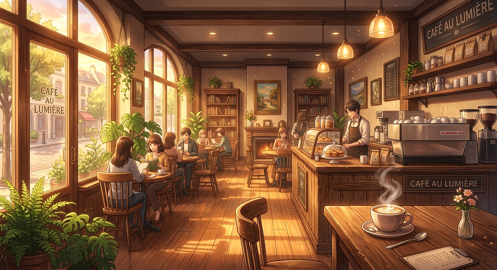

<p align="center">
  
</p>

<h1 align="center">
  ☕ Aranza · Café Romance ☕
</h1>

<p align="center">
  <i>Una novela visual interactiva · Un atardecer en Le Petit Refuge</i>
</p>

<br />

<p align="center">
  
</p>

<br />

---

## 💖 Para Aranza

Este rincón digital fue creado con todo mi cariño, pensando en tus ojos y en la forma en que la luz del atardecer baila en tu sonrisa.

Cada línea de código, cada elección, cada final escrito está dedicado a ti. Porque al igual que en esta historia, conocerte fue como entrar a una cafetería cálida en una tarde fría — un refugio inesperado que cambió todo.

<br />

## 📖 La Historia

Eres **Aranza**. Una tarde de jueves, buscando refugio del ruido del mundo, entras a *"Le Petit Refuge"*, una cafetería de techos altos, aroma a madera y luz dorada. Allí, junto al ventanal del fondo, ves a **un chico misterioso** escribiendo en una libreta de cuero.

Sus miradas se cruzan. Y el destino, cómplice, te ofrece tres mesas libres...

**¿Qué harás?**

Cada decisión cuenta. Cada palabra teje un final distinto.

<br />

## 🎮 Cómo Jugar

| Tecla / Acción | Efecto |
|---|---|
| 🖱️ Click en opciones | Toma decisiones que afectan la historia |
| ⏩ Click en el diálogo | Salta el efecto de máquina de escribir |
| 🔊 Botón de volumen | Activa/desactiva la música ambiental (sintetizada) |
| 📊 Sintonía | Revisa tus estadísticas de afinidad en tiempo real |
| 📜 Historial | Revisa todos los diálogos de la sesión |
| 🏆 Galería | Descubre los 10 finales diferentes |

<br />

## 🎭 10 Finales

<p align="center">
  
  
</p>

Cada elección modifica **6 estadísticas** (Afinidad, Confianza, Romance, Comodidad, Interés Mutuo y Curiosidad) que determinan cuál de los 10 finales obtienes:

1. 💕 **Amor Verdadero** — Almas gemelas bajo la luz dorada
2. 🌙 **Primera Cita Perfecta** — Navegando el asfalto nocturno
3. 📱 **Intercambio de Números** — La promesa de un nuevo amanecer
4. 🤝 **Amigos con Potencial** — Cimientos fuertes para un gran amor
5. 🔥 **Encuentro Inolvidable** — Marcas de fuego en el alma
6. 😶 **Tímidos Demasiado Tiempo** — El silencio de las palabras no pronunciadas
7. 🚂 **Oportunidad Perdida** — Estaciones de tren que se bifurcan
8. 🌫️ **Un Sutil Malentendido** — Señales encontradas en el humo de café
9. 🌸 **Dulce Despedida** — Una lágrima de agradecimiento
10. ✨ **Destino Incierto** — El misterio continúa suspendido

<br />

## 🛠️ Tecnologías

| | |
|---|---|
| ⚛️ **React 19** | Framework de UI |
| 🟦 **TypeScript** | Tipado seguro |
| ⚡ **Vite 6** | Build tool ultrarrápido |
| 🎨 **Tailwind CSS 4** | Estilos utilitarios |
| 🎭 **Motion** | Animaciones fluidas |
| 🎵 **Web Audio API** | Música y ambiente sintetizados |
| 📦 **Lucide React** | Iconos elegantes |

<br />

## 🚀 Despliegue en GitHub Pages

El sitio está disponible en:

> **https://franeldramatico.github.io/CitaCafeteria/**

### Para actualizar:

**Opción 1 — Script automático (recomendado):**

```powershell
.\deploy.ps1
```

**Opción 2 — Manual:**
```bash
npm run build
cd dist
echo "" > .nojekyll
git init
git checkout -b gh-pages
git add -A && git commit -m "deploy"
git remote add origin https://github.com/Franeldramatico/CitaCafeteria.git
git push -f origin gh-pages
cd ..
```

> ⚠️ Asegúrate de que en GitHub → Settings → Pages, la fuente esté configurada como `gh-pages` branch, carpeta `/ (root)`.

<br />

## 💻 Desarrollo Local

```bash
# Clonar
git clone https://github.com/Franeldramatico/CitaCafeteria.git
cd CitaCafeteria

# Instalar dependencias
npm install

# Iniciar servidor de desarrollo
npm run dev

# Build de producción
npm run build
```

<br />

---

<p align="center">
  <br />
  
  <br /><br />
  Hecho con ❤️ para Aranza<br />
  <i>"El destino es un café que se sirve caliente, con un poco de azúcar y un suspiro de misterio."</i>
  <br /><br />
  <b>— Le Petit Refuge</b>
</p>
